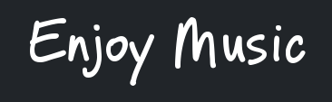
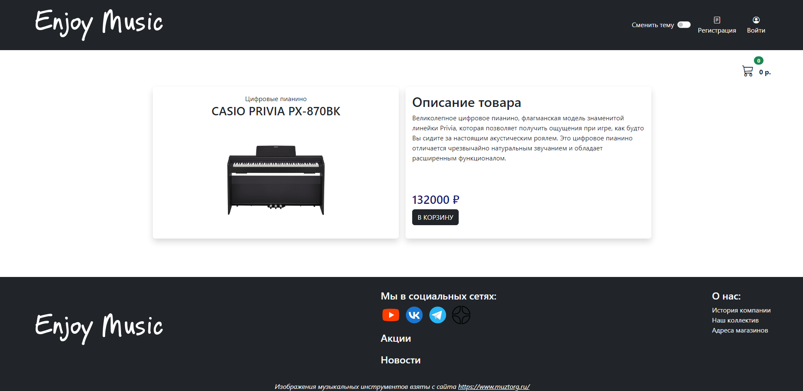

<h1 align="center">Enjoy Music</h1>

<p align="center">


</p>



## Описание проекта

Данный проект представляет собой интернет-магазин музыкальных инструментов. Проект является fullstack SPA web-приложением с адаптивной версткой.

## Из чего состоит?

- Главная страница
<p align="center">

</p>

- Страница товара
<p align="center">

</p>

- Корзина
<p align="center">

</p>

- Страница администратора
<p align="center">

</p>

- Модальное окно регистрации
<p align="center">

</p>

- Модальное окно входа
<p align="center">

</p>

- Также была реализована возможность смены темы
<p align="center">

</p>

- Стек технологий, применяемых в проекте:
<p align="center">


</p>

## Установка проекта

### Установка пакетов

```
npm install
```

### Запуск сервера (запускать, находясь в папке "server")

```
npm run serve
```

### Запуск клиента (запускать, находясь в папке "client")

```
npm start
```

### Данные для входа от имени администратора

Логин:
```
admin@mail.ru
```

Пароль:
```
Test1234
```
