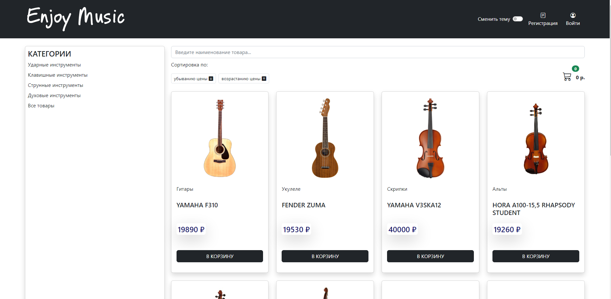
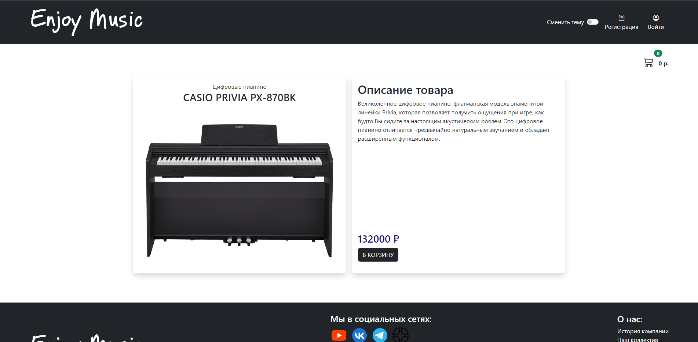
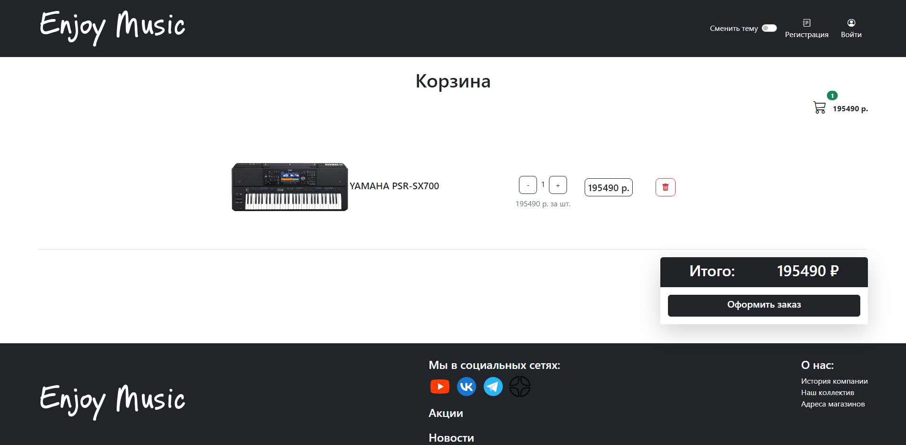
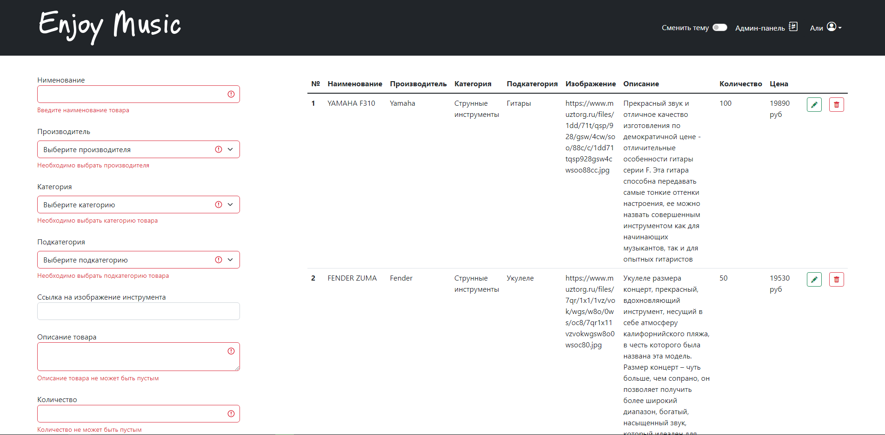
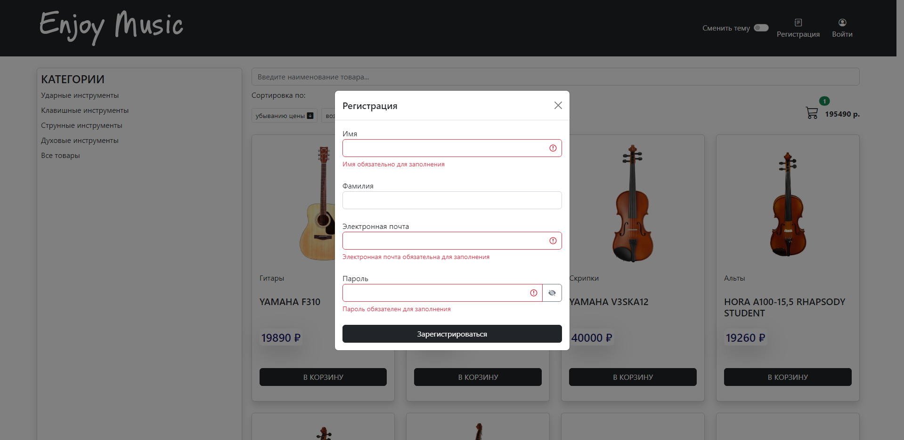
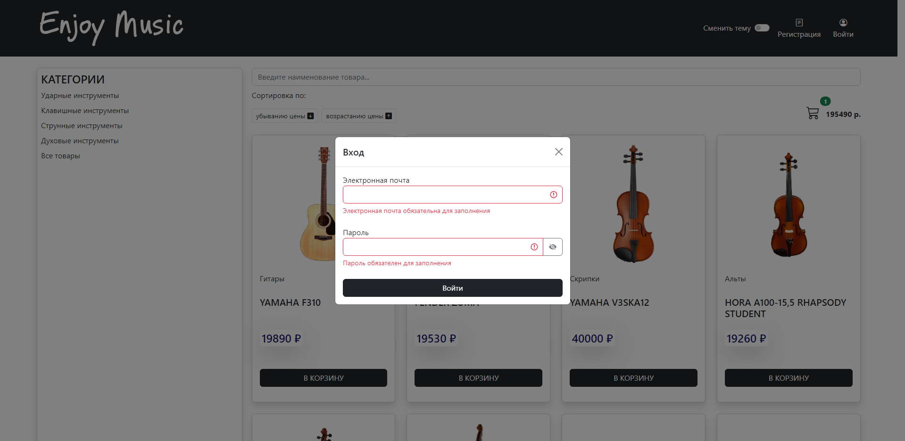

<h1 align="center">Enjoy Music</h1>

## Описание проекта

Данный проект представляет собой интернет-магазин музыкальных инструментов. Проект является адаптивным SPA web-приложением.

## Из чего состоит?

-   Главная страница

-   Страница товара

-   Корзина

-   Страница администратора

-   Модальное окно регистрации

-   Модальное окно входа

